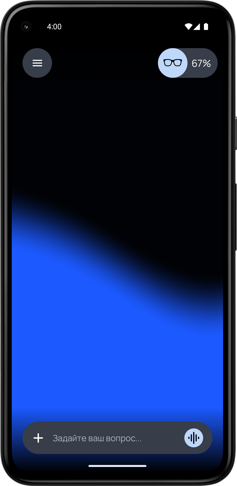
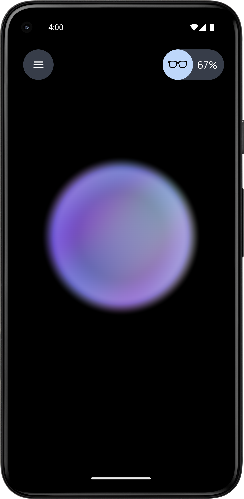
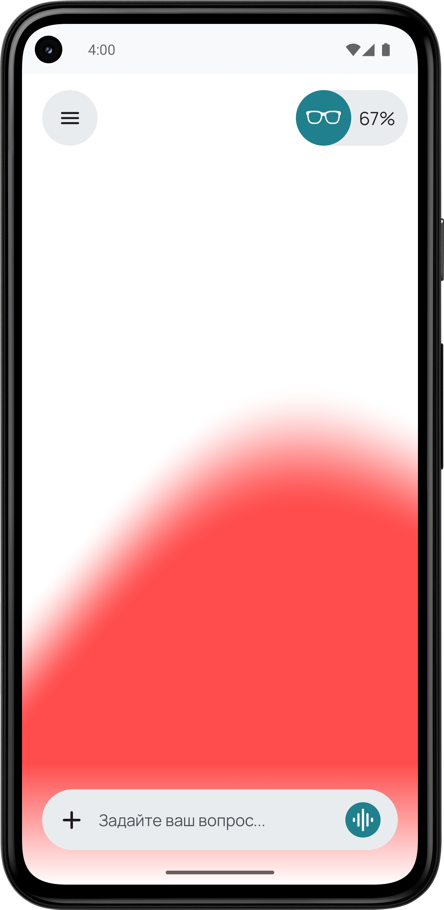
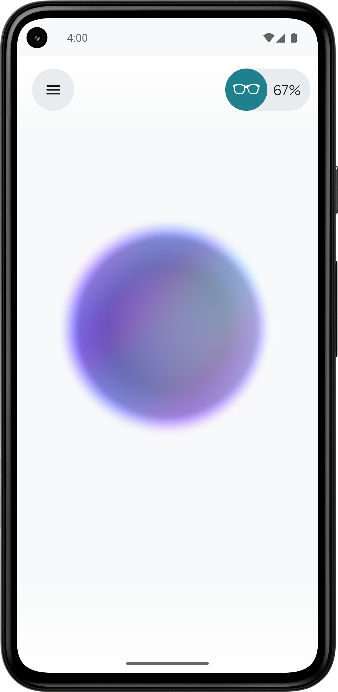

# Synapse 👓
## Русский

**Synapse** - это открытое приложение-чат с искусственным интеллектом для управления умными очками. Проект полностью **open-source**, поэтому исходный код доступен для изучения, использования и развития сообществом.

**Synapse** - это **pet-проект**, созданный в экспериментальном формате. Поэтому некоторые функции и решения могут иметь свои особенности, а приложение может активно развиваться и меняться.

## Приложение-чат для умных очков с искусственным интеллектом

Данное Android-приложение представляет собой универсальный чат-клиент для общения с искусственным интеллектом и центральный хаб для умных очков. Оно позволяет подключаться к различным ИИ-сервисам через их API, с возможностью настройки нескольких провайдеров и переключения между ними на лету.

## Предпросмотр приложения
 

 
## Ключевые возможности:

* 💬 Чат с ИИ - общение с различными моделями искусственного интеллекта в едином интерфейсе

* 🔄 Поддержка нескольких API - добавление и настройка нескольких ИИ-моделей с возможностью быстрого переключения между ними прямо в приложении

* 👓 Хаб для умных очков - центральная точка управления совместимыми устройствами умных очков

## Текущее состояние:

⚠️ Обратите внимание: Проект находится в активной разработке. Многие запланированные функции ещё не реализованы, и приложение может работать не в полном объёме. Используйте с осторожностью и будьте готовы к значительным изменениям

  

## English

**Synapse** is an **open-source** AI chat application designed for interacting with and controlling smart glasses. The entire project is fully open source, making its source code available for anyone to explore, use, and contribute to.

**Synapse** is a **pet project** built with an experimental spirit, so it comes with its own quirks and unique characteristics. Features and functionality may evolve, change, and improve over time.

## Chat app for smart glasses with artificial intelligence

This Android app is a universal chat client for communicating with artificial intelligence and a central hub for smart glasses. It allows you to connect to various AI services via their API, with the option to configure multiple providers and switch between them on the fly.

## Application Preview
 

 
## Key features:

* 💬 AI chat — communication with various artificial intelligence models in a single interface.
* 🔄 Support for multiple APIs — adding and configuring several AI models with the ability to quickly switch between them directly in the app.
* 👓 Hub for smart glasses — a central control point for compatible smart glasses devices.

## Current status:
⚠️ Please note: the project is under active development. Many planned features have not yet been implemented, and the application may not function fully. Use with caution and be prepared for significant changes.
